#
# **Fhunder - Decentralized Confidential Crowdfunding Platform on Fhenix Network**

### **Overview:**

Fhunder is a decentralized crowdfunding solution that ensures the confidentiality of backers through Fully Homomorphic Encryption (FHE) operations and NFTs.   
Built on the Fhenix network, users can anonymously contribute to campaigns and claim rewards without revealing how much they funded. The platform will be designed with essential features for campaign creation, funding, and NFT rewards, ensuring a privacy-focused experience.

### **Core Features:**

1. **User Authentication with MetaMask:**
	- users will log in using their MetaMask wallets, connecting to the Fhenix L2 network for seamless interaction.
2. **Start a New Funding Campaign:**
	- Logged-in users can create a new crowdfunding campaign using a basic form.
	- Each campaign will have a funding goal, campaign description, deadline, and minimum contribution amount.
	- FHE will be used to handle sensitive data like contributions without revealing the actual funding amounts to unauthorized parties.
3. **User Dashboard for Active Campaigns:**
	- Campaign owners will have access to a personalized dashboard showing all their active campaigns and the progress toward funding goals.
4. **Explore Public Campaigns (without login):**
	- Non-logged-in users can browse public campaigns.
	- Logged-out users can view the campaign description and funding progress without interacting (e.g., contributing or claiming rewards).
5. **Contribute to a Campaign (Fund Using MetaMask):**
	- Logged-in users can fund any active campaign using Fhenix tokens, according to the minimum contribution amount of each campaign.
    - User can't see other funders contributions nor the current amount of funds raised (OPTIONAL: show progresss buckets (1/3, 2/3, 3/3))
	- Funding details will remain confidential using FHE, protecting the exact amount from public visibility.
6. **NFT Rewards for Funders (Confidential):**
	- Funders will receive an NFT as proof of contribution, but the amount contributed will remain confidential.
	- These NFTs serve as a badge for backers but do not reveal their funding amounts.
7. **Campaign Owner Withdrawal Mechanism:**
	- The campaign owner can only withdraw funds once the funding goal is met.
	- Funds are locked in a smart contract until the goal is achieved, ensuring backers' contributions are secure.

### Phases

1. MVP - Centralized state with 1 contract for all campaigns
expose minumum contribution amount to the frontend after the campaign is finished
if goal is not reached, allow the user to withdraw his funds
think about decrypting who's contributed
[OPTIONAL] allow users to get refunds
2. NFT Rewards
3. Campaigns Factory - Generate a new contract foreach campaign
4. Campaigns Proxy - Use a proxy per generated cammpaign contract for future upgrades & migrations``

  

# **Technical Details:**

1. **Frontend:**
	- **Technology Stack:** React/Next.js, MetaMask integration, and `fhenix.js` for blockchain interactions.
	- **User Interface:** A simple, easy-to-use interface for browsing, funding, and campaign creation.
2. **Smart Contracts:**
	- **Solidity-based smart contracts** to handle campaign creation, contribution logic, NFT issuance, and funding goal checks.
	- **FHE-powered contracts** for encrypted contributions and confidential funding data handling.
3. **Fhenix Network Integration:**
	- Utilize Fhenix tokens for transactions and implement the FHE libraries for confidential funding operations.
4. **Backend (Optional):**
	- Backend services for metadata storage (campaign descriptions, images, etc.).
	- IPFS or a decentralized storage solution for storing NFT metadata and campaign-related content.

  

### Campaign creation

|             | Option 1 - Campaigns Contracts Factory                                          | Option 2 - One contract to rule them all                   |
| ----------- | ------------------------------------------------------------------------------- | ---------------------------------------------------------- |
| Security    | No data can be leaked between different campaigns                               | Data might be leaked between campaigns                     |
| Maintenance | Harded to maintain, many different instances with the same bugs/volunrabilities | Easier to maintain and migrate to fixed contract if needed |
|             |                                                                                 |                                                            |

- Campaign Factory Contract: Responsible for creating new crowdfunding campaigns with specified parameters (funding goal, deadline, etc.).
- Campaign Contract: Manages the individual campaign's funding, NFT issuance, and withdrawal logic.
- NFT Contract: Handles the minting and issuance of NFTs to funders based on their contribution tier.
- Funding Contract: Manages the fund transfer process from contributors to the campaign owner once the funding goal is met.

Interactions:

1. user creates a new campaign through the Campaign Factory Contract, specifying the campaign details.
2. Contributors fund the campaign by sending Fhenix tokens to the Campaign Contract address.
3. The Funding Contract locks the funds until the funding goal is reached, at which point the funds are transferred to the campaign owner.
4. The FHE Contract encrypts the contribution amounts securely, issuing NFTs to funders based on their contribution tiers.
5. Campaign owners can withdraw funds once the goal is met through the Campaign Contract.

Security Considerations:

- Ensure proper testing and auditing of smart contracts to prevent vulnerabilities.
- Implement role-based access control for campaign management functions.
- Regularly update and monitor the system for any security threats or risks.
- Use best practices for storing private keys and sensitive data securely.
- Consider implementing multi-signature wallets for fund withdrawals to prevent single points of failure.

By following these technical specifications and considerations, the Fhunder platform can provide a secure, confidential, and user-friendly experience for decentralized crowdfunding on the Fhenix network.

 

# Architecture Diagrams

### Campaign Creation Process

   

### Funding Process

```mermaid
%% Participants Definitions
sequenceDiagram
    actor user as Funder
    participant MetaMask as MetaMask
    participant website as React Funding Page
    participant fhenixjs as FhenixJS
    participant network as Fhenix L2 Network
    participant FHE as FHE (warp drive)
    participant sc-campaign-manager as Campaign Manager
    participant sc-specific-campaign as Campaign Contract (proxy)
    participant nft as NFT Reward Contract
    

    %% Flow Diagram
    user ->> network: Login via MetaMask
    
    %% Funding Process
    user ->> website: Show all active campaigns
    website ->> sc-campaign-manager: Get all active campaigns
    sc-campaign-manager -->> website: Return all active campaigns
    website -->> user: Show all active campaigns
    user ->> website: Select Campaign & Amount to Fund
    website ->> fhenixjs: Encrypt Contribution Amount
    fhenixjs ->> FHE: Return Encrypted Contribution Amount
    FHE -->> network: Return Encrypted Contribution Amountֿ
    network -->> fhenixjs: Return Encrypted Contribution Amount
    fhenixjs ->> sc-specific-campaign: Fund Campaign with Encrypted Amount
    sc-specific-campaign ->> sc-specific-campaign: Verify Minimum Contribution
    sc-specific-campaign ->> nft: Issue NFT Reward Based on Contribution
    nft -->> user: Send NFT
```

   

### Funds Withdrawal Process

Features to add : 
1. Add minimum contribution amount
2. Permits (sealoutput to show the user his past contributions)
